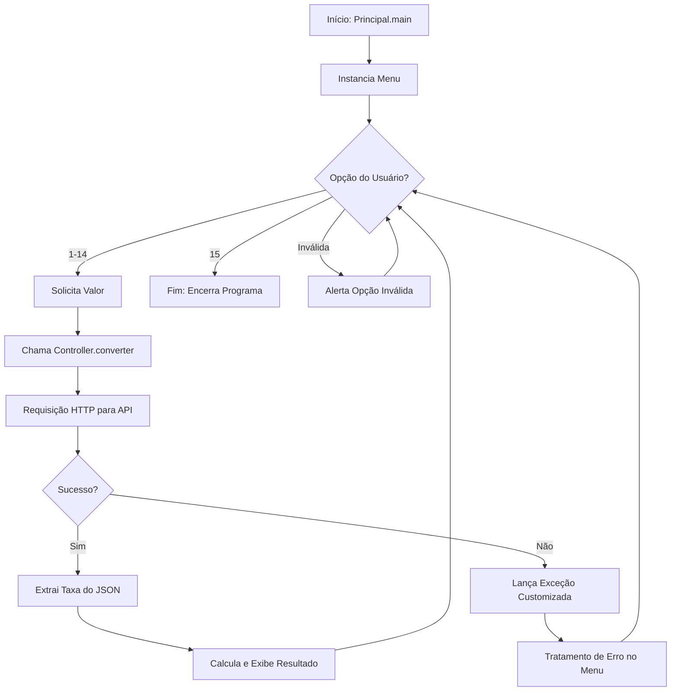

# Conversor de moedas 💱

Um conversor de moedas interativo desenvolvido em Java que utiliza a **ExchangeRate-API** para obter taxas de câmbio em tempo real. O projeto segue princípios de Orientação a Objetos (SOLID), com separação clara de responsabilidades e tratamento de exceções customizadas.

## 🚀 Funcionalidades

- Conversão entre 5 moedas principais: **Real (BRL)**, **Dólar (USD)**, **Euro (EUR)**, **Iene (JPY)** e **Yuan (CNY)**.
- Total de 14 pares de conversão disponíveis.
- Interface de linha de comando intuitiva com menu organizado.
- Consulta de taxas de câmbio em tempo real via API REST.
- Tratamento robusto de erros (conexão, parsing de dados e moedas inexistentes).

## 🛠️ Tecnologias Utilizadas

- **Java 17+**: Linguagem principal do projeto.
- **Java HttpClient**: Para realizar requisições HTTP assíncronas/síncronas.
- **ExchangeRate-API**: Provedor das taxas de câmbio.
- **Manipulação de JSON**: Extração manual de dados para evitar dependências externas pesadas.

## 📊 Fluxograma do Projeto



## 📂 Estrutura de Pacotes

```text
src/com/conversor/de/moedas/
├── controller/
│   └── Controller.java       # Lógica de comunicação com a API e parsing
├── excecao/
│   ├── ErroConexaoException.java
│   ├── MoedaNaoEncontradaException.java
│   └── RespostaInvalidaException.java
└── principal/
    ├── Principal.java        # Ponto de entrada (Main)
    └── Menu.java             # Interface com o usuário e controle de fluxo
```

## ⚙️ Como Usar

### Pré-requisitos
- JDK 17 ou superior instalado.
- Conexão com a internet (para consultar a API).

### 1. Clonar o Repositório
```bash
git clone https://github.com/seu-usuario/conversor-de-moedas.git
cd conversor-de-moedas
```

### 2. Compilação via Terminal (`javac`)
Para compilar o projeto a partir da pasta `src`:
```bash
javac com/conversor/de/moedas/principal/Principal.java com/conversor/de/moedas/controller/Controller.java com/conversor/de/moedas/excecao/*.java com/conversor/de/moedas/principal/Menu.java
```

### 3. Execução
```bash
java com.conversor.de.moedas.principal.Principal
```

## 🛡️ Tratamento de Exceções

O projeto conta com um sistema de exceções personalizadas para garantir a resiliência do software:
- **ErroConexaoException**: Captura falhas de rede ou serviço indisponível.
- **MoedaNaoEncontradaException**: Validada se a moeda solicitada existe na resposta da API.
- **RespostaInvalidaException**: Trata erros de formato no JSON retornado.

## 👤 Autor

Desenvolvido por **Alexander Nunes**.

---
*Este projeto foi realizado como parte de um desafio de consumo de APIs em Java.*
